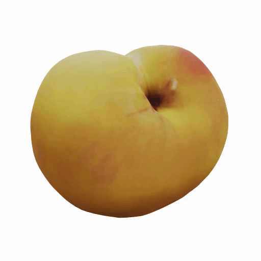
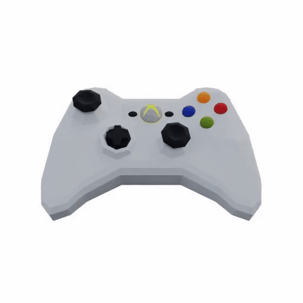

  <h1>3D Object Reconstruction</h1>
  
<b>3D Object Reconstruction using 2D Images taked by various poses</b>

 

## 3D Objects

<table align="center">
  <tr>
    <td align="center"><b>Peach</b></td>
    <td align="center"><b>Cereal</b></td>
    <td align="center"><b>Controller</b></td>
  </tr>
  <tr>
    <td width="33%">
      
    </td>
    <td width="33%">
      
    </td>
    <td width="33%">
      
    </td>
  </tr>
</table>

 

## Project Overview

* **Objective:** To generate accurate 3D models from 2D images by extracting camera spatial relationships and mapping them into 3D space.
* **Key Features:**
  * Implemented an advanced architecture that utilizes visual geometry of 2D image features into 3D point clouds and structures.
  * Developed an automated system that interprets structural depths and multi-view contexts from standard 2D inputs to construct comprehensive 3D representations.
